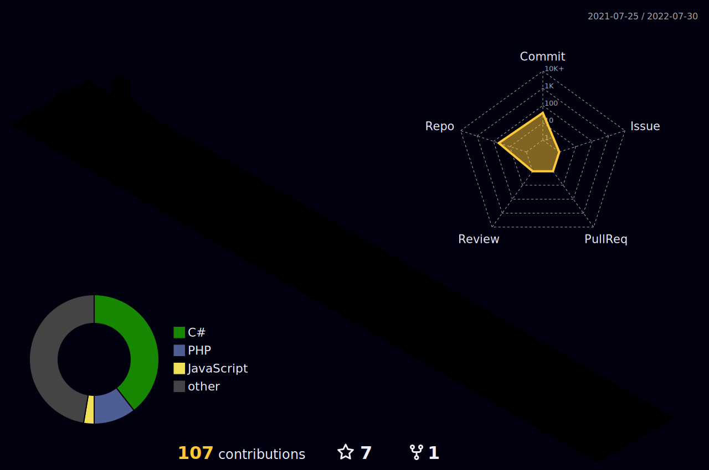

*Cursei engenharia da computação na UNIVESP, e depois análise e desenvolvimento de sistemas na UNINOVE, durante o período que estava na faculdade fiz estágio na área de desenvolvimento web, onde atuava mais como pessoa desenvolvedora de front-end com as tecnologias **Wordpress**, **Angular**, **HTML**, **CSS**, **JavaScript**, **TypeScript**, **Firebase**, **Bootstrap**, **jQuery** e **Node.js**.*

*Tenho mais de 3 anos de experiência com atendimento ao cliente(telemarketing receptivo), com produtos de consórcio, internet, bancos, seguros, telefone e computadores. Nas áreas de SAC, Backoffice, Suporte Técnico, Auditoria e Cobrança.*

*Atualmente sou desenvolvedor back-end na CoreBiz. Desenvolvendo aplicações voltadas ao e-commerce com as tecnologias **PHP**, **Laravel**, **Vue.js**, **MySQL**, **VTEX** e **Docker***

##

    

##

    
    

##

<!--
**brunomotadev/brunomotadev** is a ✨ _special_ ✨ repository because its `README.md` (this file) appears on your GitHub profile.
-->
